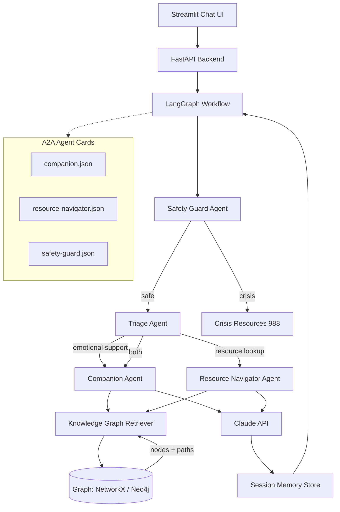

# Anima — Academic Stress & Burnout Companion

> **Hackathon Track:** Health and Wellbeing · Anthropic

A multi-agent chatbot that detects burnout patterns in academics — undergrads, grad students, and professors — and routes them to the right support before crisis hits. Powered by Claude, LangGraph, A2A, and a Karpathy-style knowledge graph.

---

## The Problem in One Sentence

Academic stress compounds silently. By the time someone asks for help, they've been struggling for months.

### Who it Affects

| Role | Core Stressors |
|---|---|
| **Undergrad** | Exam anxiety, social isolation, major uncertainty, financial pressure |
| **Grad / PhD** | Advisor conflict, research stagnation, publication pressure, imposter syndrome, funding |
| **Professor** | Grant pressure, teaching overload, tenure anxiety, service burnout, isolation |

### Why Existing Tools Fail

- University counseling has 3–6 week waitlists
- Generic apps (Calm, Headspace) don't understand academic context
- Chatbots without memory can't detect *patterns* — one bad week looks the same as six
- No system connects emotional signals to *specific* campus resources

---

## What Anima Does

1. **Daily check-in** — 60-second mood + stressor snapshot via chat
2. **Pattern detection** — LangGraph state machine tracks signals across sessions
3. **Contextual routing** — Knowledge graph maps your stressors to the right resource
4. **Explainable output** — Shows *why* it's suggesting something ("3 of the last 5 check-ins flagged sleep disruption + advisor tension")
5. **Safe escalation** — Hard-coded crisis guard that always surfaces 988 when needed

---

## System Architecture



---

## Karpathy-Style Knowledge Graph

Inspired by Andrej Karpathy's approach to knowledge as a **traversable wiki** — every concept is a node with structured metadata, connected to related concepts by typed edges. The graph is pre-seeded with academic mental health domain knowledge.

### Node Types

| Type | Examples |
|---|---|
| `Stressor` | `advisor_conflict`, `research_stagnation`, `financial_stress`, `exam_anxiety` |
| `Signal` | `sleep_disruption`, `motivation_loss`, `social_withdrawal`, `crying_spells` |
| `Resource` | `counseling_center`, `writing_center`, `ombudsperson`, `988_lifeline` |
| `CopingStrategy` | `boundary_setting`, `small_step_planning`, `peer_support`, `journaling` |
| `RiskPattern` | `burnout_early`, `burnout_severe`, `crisis_ideation`, `attrition_risk` |

### Edge Types

| Edge | Meaning |
|---|---|
| `TRIGGERS` | Stressor → Signal |
| `INDICATES` | Signal → RiskPattern |
| `ADDRESSES` | Resource → Stressor |
| `MITIGATES` | CopingStrategy → Stressor |
| `ESCALATES_TO` | RiskPattern → Resource |

### Why This Works

When a user signals "I haven't slept in days and I'm avoiding my advisor", the retriever:
1. Maps `sleep_disruption` → `INDICATES` → `burnout_early`
2. Maps `advisor_avoidance` → `INDICATES` → `burnout_early` + `attrition_risk`
3. Traverses `burnout_early` → `ESCALATES_TO` → `counseling_center`
4. Returns the path as an **explanation** to the user — not a black box

---

## Agent Design (A2A)

### Safety Guard Agent
- **Runs first, always** — no bypass
- Pattern matches on crisis keywords (self-harm, suicidal ideation, hopelessness)
- If triggered: surfaces 988 + campus emergency line immediately, halts other agents
- A2A card: `agents/safety-guard.json`

### Triage Agent
- Classifies incoming message: emotional support needed / resource lookup needed / both
- Routes to Companion and/or Resource Navigator
- Uses signal vocabulary extracted by Claude

### Companion Agent
- Empathetic conversational support via Claude
- System prompt enforces: validate first, never diagnose, warm soft escalation
- Maintains session context (last 5 check-ins summarized)
- A2A card: `agents/companion.json`

### Resource Navigator Agent
- Queries the knowledge graph with extracted stressor signals
- Returns ranked resources with graph-path explanation
- Adapts to role (undergrad / grad / professor)
- A2A card: `agents/resource-navigator.json`

---

## LangGraph Workflow

```
START
  └─→ safety_check         # always first
       ├─→ [crisis]   → emit_crisis_resources → END
       └─→ [safe]     → extract_signals
                              └─→ triage
                                   ├─→ companion_node
                                   ├─→ resource_node
                                   └─→ merge_response
                                            └─→ update_memory → END
```

**State schema:**
```python
class AnimaState(TypedDict):
    messages: list[BaseMessage]
    role: Literal["undergrad", "grad", "professor"]
    signals: list[str]
    risk_level: Literal["low", "moderate", "high", "crisis"]
    resources: list[dict]
    session_id: str
    turn_count: int
```

---

## Repository Structure

```
Anthropic-Healthcare/
├── app.py                        # Streamlit UI entry point
├── requirements.txt
├── .env.example
│
├── src/
│   ├── workflow.py               # LangGraph state machine
│   ├── agents/
│   │   ├── safety_guard.py       # Crisis detection (runs first)
│   │   ├── triage.py             # Signal extraction + routing
│   │   ├── companion.py          # Empathy + conversation
│   │   └── resource_navigator.py # KG-backed resource lookup
│   ├── graph/
│   │   ├── loader.py             # Load KG from JSON seed
│   │   ├── retriever.py          # Traverse graph, return paths
│   │   └── schema.py             # Node/edge type definitions
│   ├── memory.py                 # Session memory (in-memory dict)
│   └── prompts.py                # All Claude system prompts
│
├── agents/                       # A2A agent card JSONs
│   ├── companion.json
│   ├── resource-navigator.json
│   └── safety-guard.json
│
├── data/
│   └── knowledge_graph.json      # Pre-seeded KG (stressors, resources, edges)
│
└── tests/
    ├── test_safety_guard.py
    ├── test_graph_retriever.py
    └── test_workflow.py
```

---

## Quick Start

```bash
git clone https://github.com/your-repo/Anthropic-Healthcare
cd Anthropic-Healthcare
python -m venv .venv && source .venv/bin/activate
pip install -r requirements.txt

cp .env.example .env
# Add your ANTHROPIC_API_KEY to .env

streamlit run app.py
```

Optional — run the FastAPI backend separately (if using decoupled mode):
```bash
uvicorn src.api:app --reload --port 8000
```

---

## Tech Stack

| Layer | Choice | Why |
|---|---|---|
| UI | Streamlit | Zero frontend code, ships in minutes |
| Backend | FastAPI | Async, clean REST, easy to test |
| LLM | Claude (claude-sonnet-4-6) | Best-in-class safety + instruction following |
| Orchestration | LangGraph | State machine flow, built-in streaming, checkpointing |
| Agent protocol | A2A SDK | Interoperability, judge-visible agent cards |
| Knowledge graph | NetworkX + JSON seed | No Docker needed for demo; swap to Neo4j in prod |
| Embeddings | sentence-transformers | Local, fast, no extra API calls |
| Memory | In-process dict (session) | Simple, works for demo; Redis in prod |

---

## A2A Agent Cards (Sample)

**`agents/companion.json`**
```json
{
  "name": "anima-companion",
  "version": "1.0.0",
  "description": "Empathetic academic wellbeing companion. Validates, supports, and gently routes.",
  "capabilities": ["emotional_support", "burnout_check_in", "advisor_prep"],
  "input_schema": {
    "message": "string",
    "role": "undergrad | grad | professor",
    "session_id": "string"
  },
  "output_schema": {
    "response": "string",
    "signals_detected": ["string"],
    "escalate": "boolean"
  }
}
```

---

## Safety Design

**Hard rules — no exceptions:**
- Never diagnose mental illness
- Never give medical advice
- Always surface 988 when crisis signals detected
- Never store raw journal text — only structured signals
- No advisor or department can access individual data

**Crisis threshold:** any of — `suicidal_ideation`, `self_harm`, `hopelessness_severe`, `"I want to disappear"` pattern → immediate 988 surface + session flag.

---

## Evaluation Criteria

| What judges see | What it demonstrates |
|---|---|
| Live chat check-in → burnout detection in <10s | End-to-end latency, UX quality |
| Knowledge graph path shown below response | Explainability, KG integration |
| A2A agent cards at `/agents/` | A2A protocol compliance |
| Role switching (undergrad vs professor) | Context-aware personalization |
| Crisis keyword → 988 surface instantly | Safety-first design |
| LangGraph trace in sidebar | Agentic orchestration |

---

## What's Not in Scope (Hackathon Cut)

- Real university database integration (we seed the graph)
- Persistent multi-session memory (we use in-process dict)
- Auth / login (single anonymous session)
- Multilingual support
- IRB-approved deployment

---

## References

- Evans et al., *Nature Biotechnology*, 2018 — graduate student mental health survey
- Levecque et al., *Research Policy*, 2017 — PhD mental health risk factors
- U-DOC Systematic Review — supervisor relationship as protective factor
- [LangGraph Docs](https://langchain-ai.github.io/langgraph/)
- [A2A Protocol](https://google.github.io/A2A/)
- [Claude API Docs](https://docs.anthropic.com)
- [988 Suicide & Crisis Lifeline](https://988lifeline.org)
- Karpathy, "The Unreasonable Effectiveness of Recurrent Neural Networks" — knowledge graph traversal philosophy
